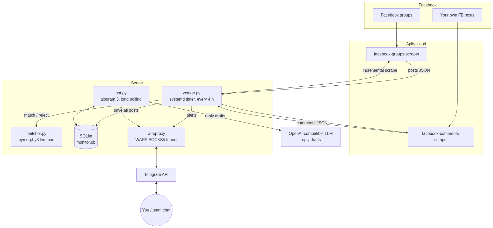
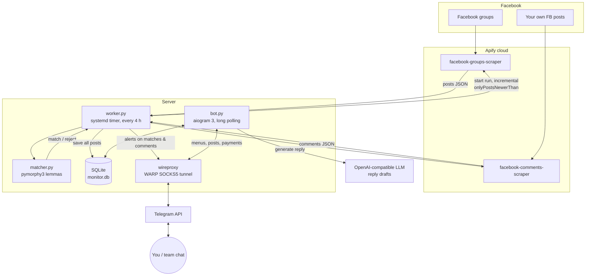

# FB Group Monitor

Telegram-bot dashboard that watches Facebook groups for people looking for accommodation and turns them into leads — built for an apartment/hotel network in Montenegro.

🌐 **Landing page:** [neo37.github.io/fb-group-monitor](https://neo37.github.io/fb-group-monitor/)

## Table of contents

- [🇷🇺 Документация на русском / Russian docs](README.ru.md)
- [🌐 GitHub Pages site](https://neo37.github.io/fb-group-monitor/)
- [Architecture](#architecture)
- [How it works, in detail](#how-it-works-in-detail)
  - [1. Scraping pipeline](#1-scraping-pipeline)
  - [2. Keyword matching](#2-keyword-matching)
  - [3. Telegram bot (the dashboard)](#3-telegram-bot-the-dashboard)
  - [4. Reply generation (LLM)](#4-reply-generation-llm)
  - [5. Access control & Stars payments](#5-access-control--stars-payments)
  - [6. Running behind a Telegram-blocked network](#6-running-behind-a-telegram-blocked-network)
- [Setup](#setup)
- [Configuration](#configuration)
- [Files](#files)
- [Costs](#costs)
- [License](#license)

## Architecture



<details>
<summary>Mermaid source</summary>



</details>

## How it works, in detail

### 1. Scraping pipeline

`worker.py` runs on a systemd timer **6 times a day** (every 4 hours). Each pass:

1. Reads the enabled group URLs from SQLite (`groups` table). Share links (`facebook.com/share/g/…`) are fine — the Apify actor resolves them.
2. Starts the Apify actor `apify/facebook-groups-scraper` with `onlyPostsNewerThan` set to the **timestamp of the previous successful pass** (stored in the `state` table, with a 30-minute overlap for safety). The first ever pass takes the last 24 hours.
3. Saves **every** fetched post into `seen_posts` (deduplicated by post URL). Filtering never happens at write time — this is what makes filters *reactive*: change a keyword and the whole history is re-evaluated instantly.
4. Runs the matcher over new posts and pushes a Telegram alert for every match.
5. Separately, `facebook-comments-scraper` checks your own posts (`my_posts` table) — **any** new comment triggers an alert, no filtering.
6. Any exception is caught and reported to Telegram as a ⚠️ alert.

### 2. Keyword matching

`matcher.py` normalizes every word to its lemma with **pymorphy3**, so Russian morphology is handled: *ищу / ищем / ищете* → *искать*.

- A post **matches a phrase** when it contains **all** words of that phrase (stop-words `в/на/с/и/у/по/за/для` are skipped). `ищу квартиру` catches "Ищем квартиру в Будве".
- A **negative keyword or phrase** (all its words present) found in the post kills the match: landlord verbs (*сдам, продаю*), ad noise (*трансфер, экскурсия*), wrong geography (*лондон, испания, турция…*).
- A **per-post blacklist** (🚫 button in the bot) hides an exact post from every view and export.
- Both dictionaries live in SQLite and are edited from the bot. Views and CSV exports re-annotate posts on every request, so edits apply retroactively.

### 3. Telegram bot (the dashboard)

`bot.py` (aiogram 3, long polling). Menu:

| Button | What it does |
|---|---|
| 📋 Посты | Pick a day of the last week → only posts that **passed the filters**, grouped by source group. The raw unfiltered feed is available only via CSV export. |
| 👤 Профиль | Chat ID, access status, ⭐ favorites, 🚫 blacklist, 💳 top-up, 🚪 logout |
| 📤 CSV | Week or full export; every post row carries its match phrase or the negative word that cut it. All fields quoted, commas as separator, inner quotes sanitized. |
| 🔑 Ключевые слова | Add/remove match phrases (stored lowercase) |
| 🚫 Минус-слова | Add/remove negative keywords |
| 👥 Группы | Group cards: open in FB, copy link, delete |
| 📝 Мои посты | Your FB posts watched for comments |

Under every post: ⭐ favorite, ✍️ AI reply, 📋 copy post text to clipboard (native Telegram copy button), 🚫 blacklist.

### 4. Reply generation (LLM)

The ✍️ button sends the post text to any **OpenAI-compatible** `/chat/completions` endpoint (model, URL and key from `.env`). The prompt asks for a short friendly reply in the post's language, hooked to its details (dates, city, party size), pitching your site. Result comes with «📋 copy», «↗ open post» and «🔁 regenerate» buttons.

### 5. Access control & Stars payments

- The owner's DM (`TG_CHAT_ID`) is always authorized.
- Everyone else authorizes with a password. **Daily password** = digit sum of today's date `DDMMYYYY` + 36, valid until midnight. **Monthly password** = |digit sum of `01.MM.YYYY` − digit sum of `30.MM.YYYY`| + 36, valid until month end. Expiry is stored per chat in `authorized_chats`.
- Passwords are sold as **generated PNG images** (Pillow) via **Telegram Stars** invoices (`currency: XTR`): day — 198 ⭐, month — 5000 ⭐.
- 🚪 Logout wipes the chat's authorization (works in groups too).
- Note: in groups the bot must be an admin (or privacy mode off) to see the password message.

### 6. Running behind a Telegram-blocked network

If the server cannot reach `api.telegram.org` (e.g. RU hosting), the stack still works:

1. Register a free Cloudflare WARP account **from any unblocked machine**: `wgcf register && wgcf generate`.
2. Run [wireproxy](https://github.com/pufferffish/wireproxy) on the server with that WireGuard profile — it exposes a local SOCKS5 (`127.0.0.1:40000`) tunnelled through WARP.
3. Set `TG_PROXY=socks5://127.0.0.1:40000` in `.env`. Only Telegram traffic goes through the tunnel; Apify and the LLM are hit directly.

## Setup

```bash
git clone https://github.com/neo37/fb-group-monitor && cd fb-group-monitor
python3 -m venv .venv
.venv/bin/pip install aiogram pymorphy3 requests pillow aiohttp-socks pysocks
cp .env.example .env   # fill in tokens
.venv/bin/python bot.py       # the bot (systemd service in production)
.venv/bin/python worker.py    # one scrape pass (systemd timer / cron)
```

Systemd units used in production: `fb-monitor-bot.service` (Restart=always), `fb-monitor-worker.service` + `fb-monitor-worker.timer` (`OnCalendar=*-*-* 00/4:00:00`), optional `wireproxy.service`.

## Configuration

| Variable | Purpose |
|---|---|
| `APIFY_TOKEN` | Apify API token |
| `TG_BOT_TOKEN` | Telegram bot token |
| `TG_CHAT_ID` | Owner DM — always authorized, receives alerts |
| `TG_CHAT_ID_2` | Optional second alert chat (e.g. team group) |
| `TG_PROXY` | Optional SOCKS5 proxy for Telegram API only |
| `LLM_API_URL`, `LLM_API_KEY`, `LLM_MODEL` | OpenAI-compatible endpoint for reply drafts |

## Files

| File | Role |
|---|---|
| `bot.py` | Telegram bot: menus, posts, favorites, blacklist, replies, auth, Stars payments |
| `worker.py` | Incremental scrape pass: groups → match → notify; comment watch |
| `matcher.py` | Lemma-based phrase matching with negative keywords |
| `apify_client.py` | Thin Apify REST client |
| `notifier.py` | Telegram alert sender (proxy-aware) |
| `imggen.py` | Password-image generator (Pillow) |
| `llm.py` | Reply drafting via LLM |
| `db.py` | SQLite schema + migrations |

## Costs

Apify `facebook-groups-scraper` (free tier): $0.005 per post + $0.002 per post with a date filter + $0.001 per run. ~20 groups polled 6×/day with incremental windows ≈ **$0.5–0.7/day**. The free plan gives $5/month; the Starter plan ($39/month) covers this setup with headroom and cheaper per-post rates.

## License

MIT
