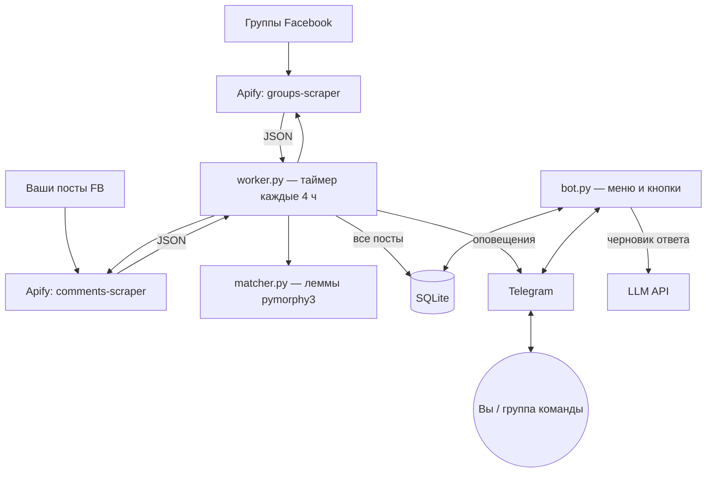

# FB Group Monitor — документация на русском

Telegram-бот-дашборд, который мониторит Facebook-группы, находит людей, ищущих жильё, и превращает их в лидов. Создан для сети апартаментов/отелей в Черногории.

🌐 Лендинг: [neo37.github.io/fb-group-monitor](https://neo37.github.io/fb-group-monitor/) · 🇬🇧 [English docs](README.md)

## Оглавление

- [Схема работы](#схема-работы)
- [Скрапинг](#скрапинг)
- [Матчинг ключевых слов](#матчинг-ключевых-слов)
- [Бот-дашборд](#бот-дашборд)
- [Генерация ответов](#генерация-ответов)
- [Авторизация и оплата Stars](#авторизация-и-оплата-stars)
- [Работа при блокировке Telegram](#работа-при-блокировке-telegram)
- [Установка](#установка)
- [Стоимость](#стоимость)

## Схема работы



## Скрапинг

Воркер запускается таймером systemd **6 раз в сутки** (каждые 4 часа) и работает **инкрементально**: в таблице `state` хранится момент последнего успешного прохода, следующий проход берёт посты только новее этой даты (с нахлёстом 30 минут; дубли отсекаются по URL поста). Первый запуск берёт сутки.

В базу пишутся **все** посты без фильтрации — фильтры применяются при чтении. Поэтому изменение словарей мгновенно меняет и старые результаты («реактивные» фильтры).

Комментарии под вашими постами (`📝 Мои посты`) проверяются отдельным актором — о каждом новом комментарии приходит оповещение без всяких фильтров. Ошибки воркера тоже прилетают в Telegram (⚠️).

## Матчинг ключевых слов

- Каждое слово приводится к лемме (pymorphy3): «ищу/ищем/ищете» → «искать».
- Пост **совпадает с фразой**, если содержит **все** её слова в любой форме (предлоги пропускаются). «ищу квартиру» ловит «Ищем квартиру в Будве».
- **Минус-слово** в тексте отменяет совпадение: глаголы арендодателей («сдам», «продаю»), реклама («трансфер», «экскурсия»), чужая география («лондон», «испания», «турция»…).
- **Чёрный список** (кнопка 🚫 под постом) скрывает конкретный пост из всех выдач и выгрузок; вернуть можно из профиля.
- Словари редактируются прямо в боте и хранятся в нижнем регистре.

## Бот-дашборд

| Кнопка | Что делает |
|---|---|
| 📋 Посты | День недели → только посты, прошедшие фильтры, сгруппированы по группам. Полный поток без фильтра — только в CSV-выгрузке. |
| 👤 Профиль | ID чата, срок доступа, ⭐ избранное, 🚫 чёрный список, 💳 пополнение, 🚪 выход |
| 📤 CSV | За неделю или полный список; у каждого поста отмечено, какая фраза совпала или каким минус-словом отсечён. Все поля в кавычках, разделитель — запятая. |
| 🔑 Ключевые слова | Добавить/удалить фразы |
| 🚫 Минус-слова | Добавить/удалить стоп-слова |
| 👥 Группы | Карточка группы: перейти, скопировать ссылку, удалить |
| 📝 Мои посты | Ваши посты FB для слежения за комментариями |

Под каждым постом: ⭐ в избранное, ✍️ ответ (LLM), 📋 текст в буфер (нативная кнопка Telegram, первые 256 символов), 🚫 в ЧС.

## Генерация ответов

Кнопка ✍️ отправляет текст поста на любой **OpenAI-совместимый** endpoint (`/chat/completions`; URL, ключ и модель — в `.env`). Промт просит короткий дружелюбный ответ на языке поста с зацепкой за детали (даты, город, число людей) и ссылкой на ваш сайт. К результату — кнопки «📋 В буфер», «↗ К посту», «🔁 Ещё вариант».

## Авторизация и оплата Stars

- Личка владельца (`TG_CHAT_ID`) авторизована всегда.
- Остальные чаты вводят пароль. **Пароль дня** = сумма цифр даты `ДДММГГГГ` + 36, действует до конца дня. **Пароль месяца** = |сумма цифр `01.ММ.ГГГГ` − сумма цифр `30.ММ.ГГГГ`| + 36, действует до конца месяца. Срок хранится в `authorized_chats`.
- Пароли продаются как **PNG-картинки** (Pillow) через **Telegram Stars**: день — 198 ⭐, месяц — 5000 ⭐.
- 🚪 «Выйти» сбрасывает авторизацию чата (работает и в группах).
- В группах бот должен быть админом (или privacy mode выключен), иначе он не увидит введённый пароль.

## Работа при блокировке Telegram

Если сервер не достаёт до `api.telegram.org` (RU-хостинг):

1. С любой машины со свободным доступом: `wgcf register && wgcf generate` — бесплатный аккаунт Cloudflare WARP и WireGuard-профиль.
2. На сервере — [wireproxy](https://github.com/pufferffish/wireproxy) с этим профилем: локальный SOCKS5 `127.0.0.1:40000` через туннель WARP.
3. В `.env`: `TG_PROXY=socks5://127.0.0.1:40000`. Через туннель ходит только Telegram; Apify и LLM — напрямую.

## Установка

```bash
git clone https://github.com/neo37/fb-group-monitor && cd fb-group-monitor
python3 -m venv .venv
.venv/bin/pip install aiogram pymorphy3 requests pillow aiohttp-socks pysocks
cp .env.example .env   # заполнить токены
.venv/bin/python bot.py       # бот (в проде — systemd-сервис)
.venv/bin/python worker.py    # один проход скрапинга (таймер systemd / cron)
```

Боевые юниты: `fb-monitor-bot.service` (Restart=always), `fb-monitor-worker.timer` (`OnCalendar=*-*-* 00/4:00:00`), опционально `wireproxy.service`.

## Стоимость

Apify (бесплатный тариф): $0.005 за пост + $0.002 за пост при фильтре по дате + $0.001 за запуск. ~20 групп × 6 проходов в сутки с инкрементальными окнами ≈ **$0.5–0.7/день**. Бесплатного плана ($5/мес) хватает на несколько дней; Starter ($39/мес) покрывает конфигурацию с запасом.
